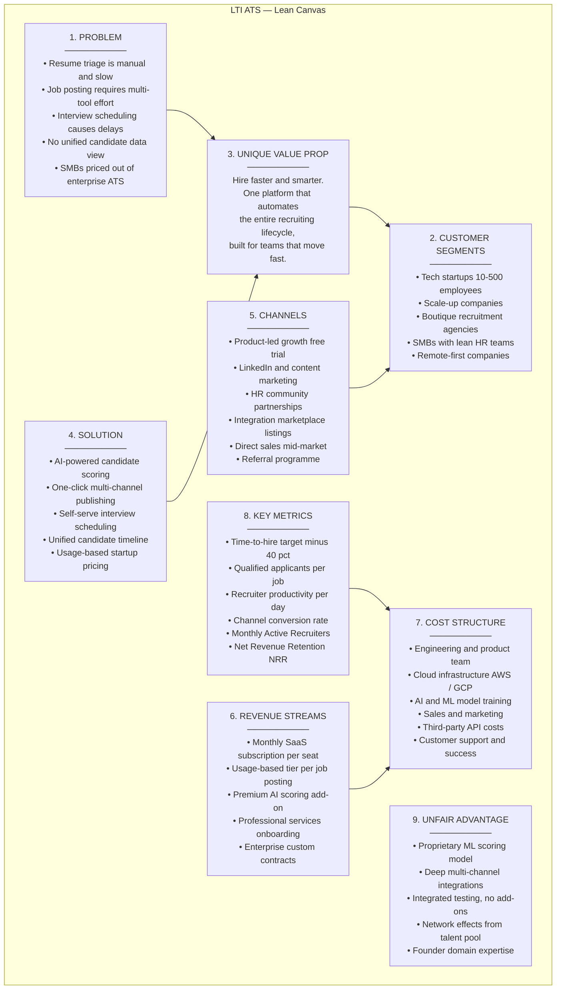
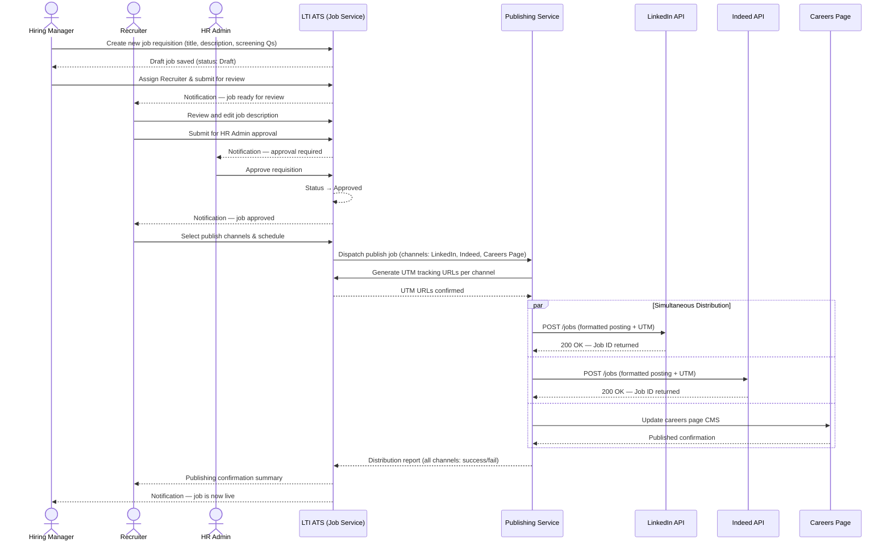
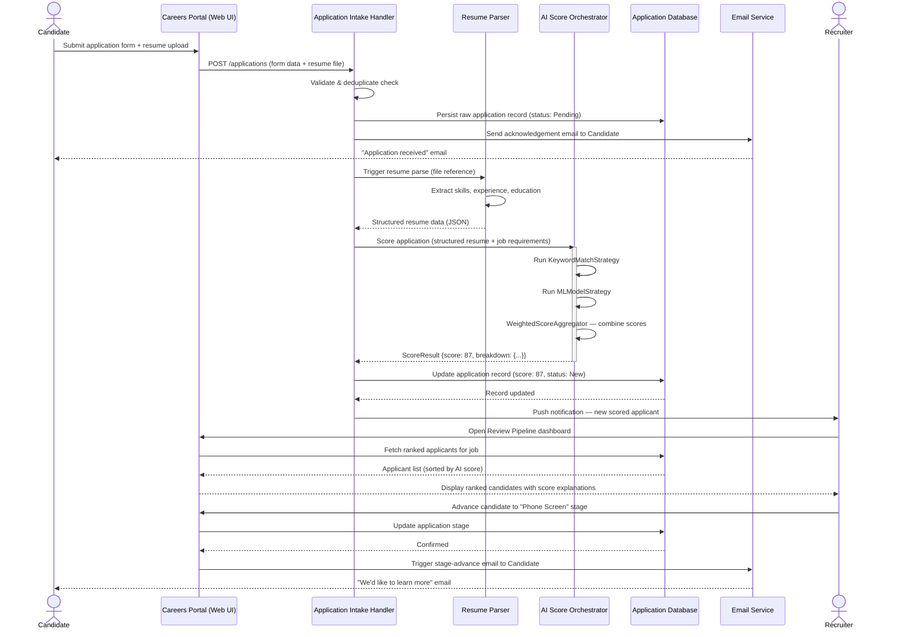
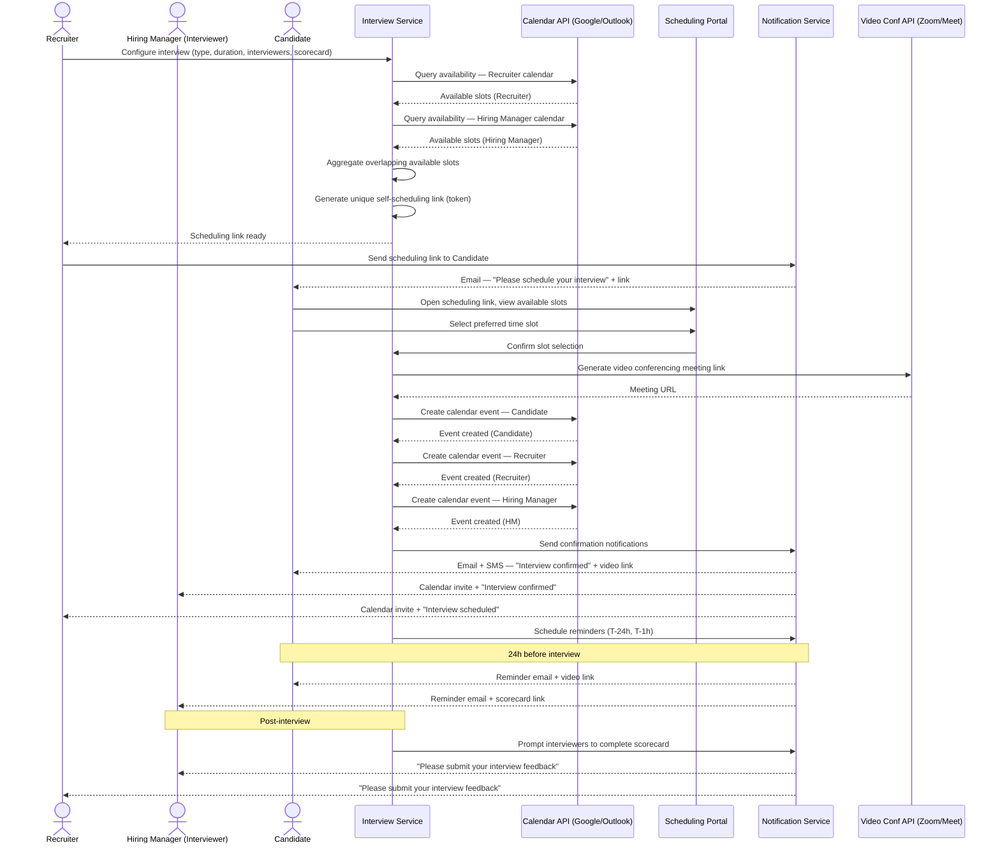
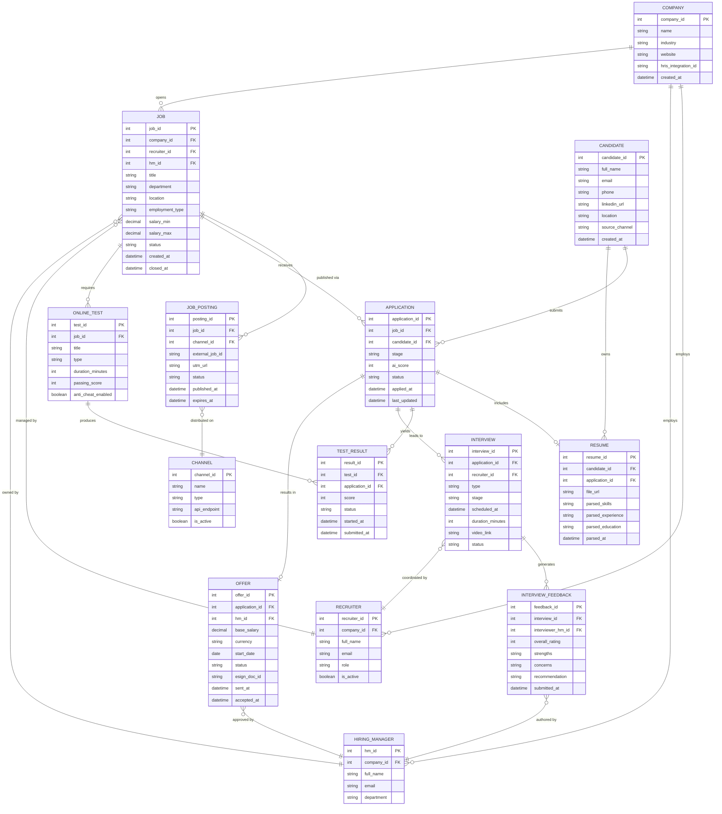
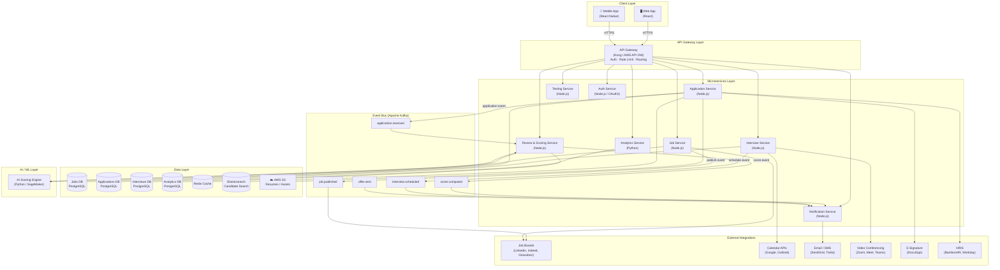
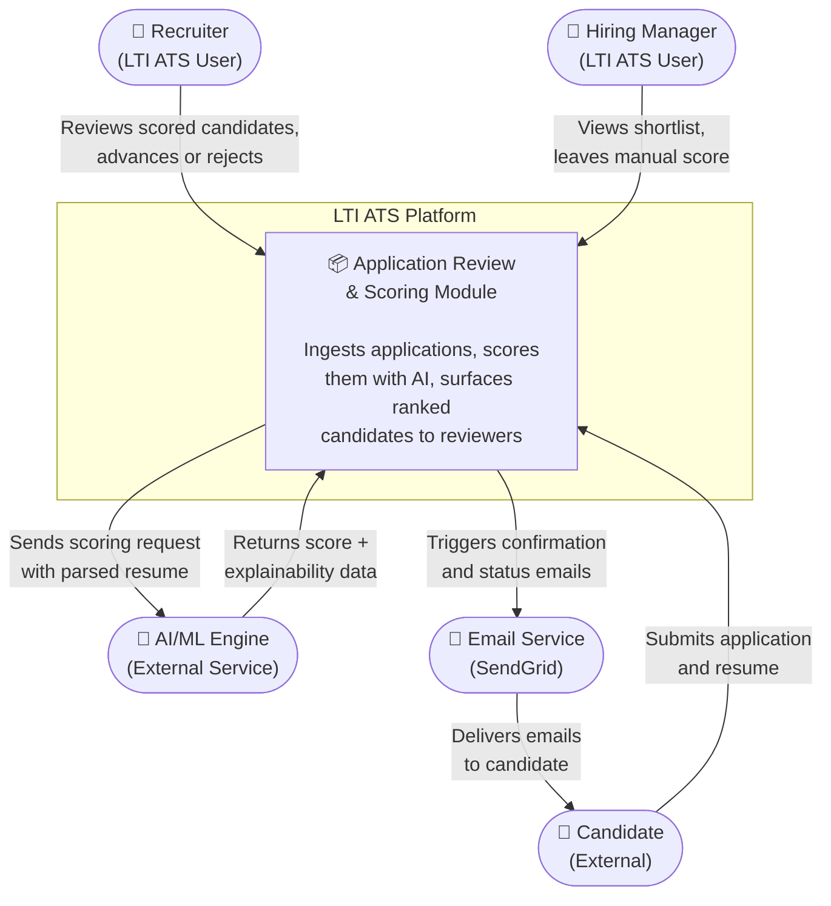
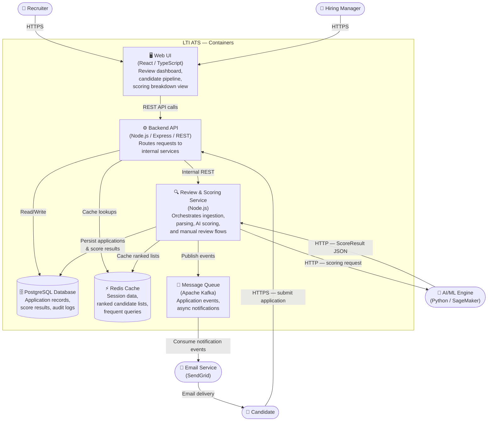
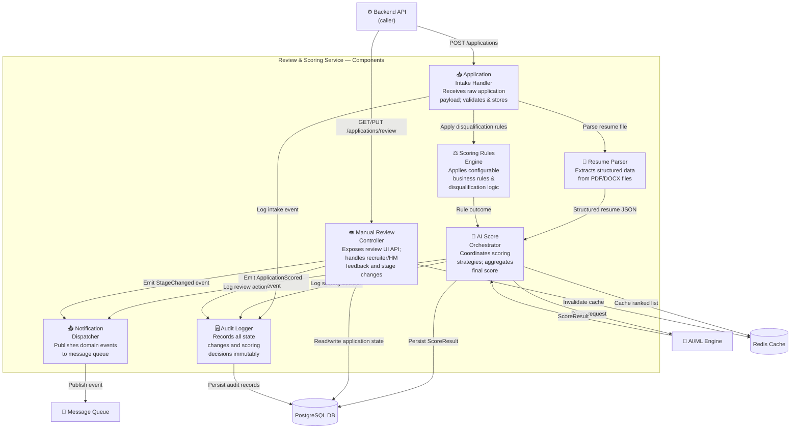
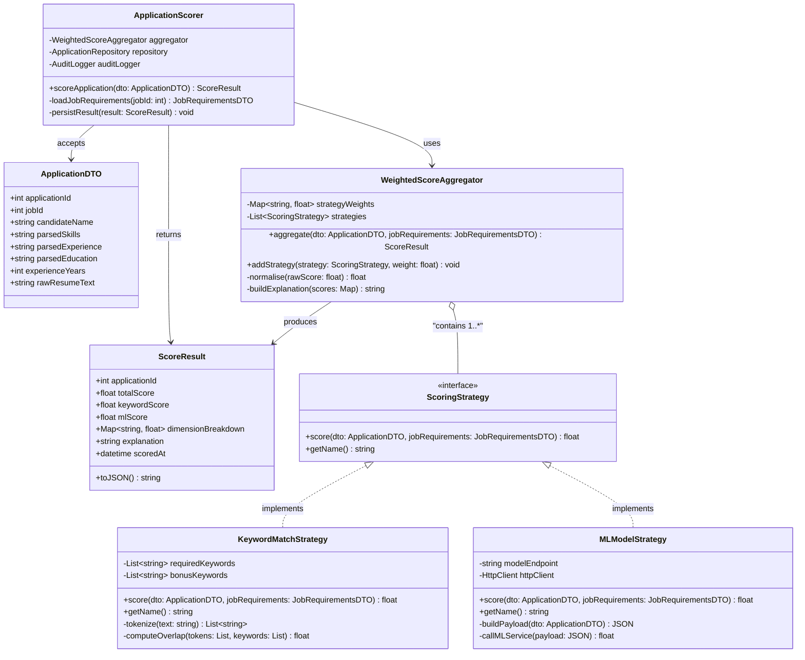

# LTI Applicant Tracking System — Technical Documentation

---

| Field | Value |
|---|---|
| **Document Name** | LTI-em.md |
| **Version** | 1.0 |
| **Date** | 2026-03-22 |
| **Authors** | LTI Engineering Team |

---

## Table of Contents

1. [Software Brief, Added Value & Competitive Advantages](#section-1--software-brief-added-value--competitive-advantages)
2. [Main Functions](#section-2--main-functions)
3. [Lean Canvas Diagram](#section-3--lean-canvas-diagram)
4. [Top 3 Use Cases with Diagrams](#section-4--top-3-use-cases-with-diagrams)
5. [Entity-Relationship Data Model](#section-5--entity-relationship-data-model)
6. [High-Level System Design](#section-6--high-level-system-design)
7. [C4 Diagram: Application Review & Scoring Module](#section-7--c4-diagram-application-review--scoring-module)

---

## Section 1 — Software Brief, Added Value & Competitive Advantages

### Overview

The **LTI Applicant Tracking System (ATS)** is a cloud-native, AI-powered hiring platform designed to help startups and growing companies manage the entire recruitment lifecycle from a single, unified interface. From creating and publishing job postings across multiple channels, to screening candidates with machine-learning assistance, conducting online assessments, scheduling interviews, and extending offers — LTI ATS eliminates the friction and fragmentation that plagues traditional hiring workflows. Built with a modern microservices architecture, the platform scales effortlessly as hiring volume grows, ensuring that a company of five can use the same tool comfortably as a company of five hundred.

LTI ATS was built with a clear philosophy: **hiring is a human process, but it should be powered by intelligent automation**. Recruiters and hiring managers spend the majority of their time on repetitive administrative tasks — parsing resumes, chasing calendar confirmations, copy-pasting job descriptions to five different job boards. LTI automates all of this, freeing HR teams to focus on what only humans can do: build relationships with candidates, evaluate cultural fit, and make thoughtful hiring decisions. The system's integrated AI scoring engine surfaces the strongest applicants to the top of the funnel in seconds, while a rich analytics dashboard gives leadership real-time visibility into pipeline health, time-to-hire, and diversity metrics.

The platform is purpose-built for the realities of startup hiring: lean HR teams, fast-moving requisitions, limited budget for enterprise software, and the need to compete with larger organizations for top talent. LTI ATS delivers enterprise-grade capability at a startup-friendly price point, with a frictionless onboarding experience that gets teams up and running within a single business day.

### Core Added Value

| Stakeholder | Added Value |
|---|---|
| **HR Recruiter** | One-click multi-channel job distribution; AI pre-screening eliminates manual resume triage; automated candidate communications |
| **Hiring Manager** | Structured interview scorecards; consolidated feedback dashboard; real-time pipeline visibility |
| **Candidate** | Smooth application experience; automated status updates; self-serve interview scheduling |
| **HR Leadership** | Real-time analytics on time-to-hire, cost-per-hire, source quality, and diversity metrics |
| **Company (CFO/CEO)** | Reduced cost of mis-hire through structured evaluation; compliance audit trails; scalable subscription pricing |

### Competitive Advantages

The table below compares LTI ATS against leading incumbents across five critical dimensions.

| Advantage | LTI ATS | Workday | Greenhouse | Lever |
|---|---|---|---|---|
| **1. AI-Assisted Screening** | Proprietary ML scoring engine with configurable keyword, skill, and behavioral weights; explainable scores visible to recruiters | Limited rule-based filters | Third-party integration required | Basic keyword matching |
| **2. Multi-Channel Job Distribution** | Native integrations with LinkedIn, Indeed, Glassdoor, AngelList, social media, and company careers page via a single publish action | Manual or limited integrations | Strong but paid add-ons | Moderate |
| **3. Integrated Online Testing** | Built-in assessment builder (coding challenges, psychometric tests, video responses) with auto-grading linked directly to the candidate record | Not included | Partner integrations only | Not included |
| **4. Real-Time Analytics Dashboard** | Live pipeline metrics, source ROI, recruiter performance, DEI funnel analysis, and predictive time-to-fill | Complex BI setup required | Good reporting, delayed | Basic |
| **5. Startup Scalability & Simplicity** | Zero-config onboarding, usage-based pricing, minimal IT footprint, intuitive UI designed for non-HR-ops users | Enterprise-only, heavy IT dependency | Mid-market focused | Mid-market focused |

Two additional advantages that differentiate LTI ATS further:

- **6. Unified Candidate Timeline:** Every interaction — application, email, test score, interview note, and offer — is stored in a single, chronological candidate record, eliminating information silos between recruiting and hiring teams.
- **7. Compliance & Audit Ready:** GDPR-compliant data handling, configurable data-retention policies, full audit logs, and structured equal-opportunity reporting ensure LTI ATS is enterprise-audit-ready from day one.

---

## Section 2 — Main Functions

### Module 1 — Job Creation

**Purpose:** Enable hiring managers and recruiters to define, structure, and approve job requisitions within a collaborative workspace before any external publication occurs.

**Key Features:**
- Rich-text job description editor with pre-built templates by role category
- Configurable approval workflows (e.g., Hiring Manager → HR Business Partner → Finance)
- Salary band and headcount integration with workforce planning data
- Custom application form builder (dropdowns, free-text, file uploads, screening questions)
- Job cloning and bulk editing for high-volume requisitions
- Internal job board visibility controls (internal-only vs. external)

**Primary Actors:** Hiring Manager, Recruiter, HR Administrator

---

### Module 2 — Job Publishing

**Purpose:** Distribute approved job postings across all desired channels simultaneously, maximising reach while minimising manual effort.

**Key Features:**
- One-click multi-channel publishing to LinkedIn, Indeed, Glassdoor, AngelList, and custom job boards
- Native integration with the company's careers page (embeddable widget or hosted page)
- Automated social media posting (LinkedIn, Twitter/X, Facebook)
- Channel-specific post formatting and character-limit compliance
- UTM tracking links per channel for source attribution analytics
- Scheduled publishing and automatic expiry/re-posting rules

**Primary Actors:** Recruiter, Marketing Coordinator (secondary), HR Administrator

---

### Module 3 — Application Ingestion

**Purpose:** Capture and centralise all incoming applications regardless of their source channel, normalising data into a unified candidate record.

**Key Features:**
- Branded candidate application portal with mobile-responsive design
- Resume parsing (PDF, DOCX, LinkedIn profile import) into structured data fields
- Duplicate candidate detection and merging
- GDPR consent capture and data-processing agreements at point of application
- Source tracking (which channel/UTM the candidate arrived from)
- Configurable acknowledgement emails sent automatically upon submission

**Primary Actors:** Candidate (external), System (automated), Recruiter

---

### Module 4 — Application Review

**Purpose:** Give recruiters and hiring managers the tools to efficiently evaluate, score, compare, and progress candidates through the hiring funnel.

**Key Features:**
- AI-powered candidate scoring with explainable skill-match breakdown
- Configurable screening question auto-disqualification rules
- Side-by-side candidate comparison view
- Kanban-style pipeline board with drag-and-drop stage progression
- Collaborative review: multiple reviewers can leave structured notes per candidate
- Bulk actions: advance, reject, or move multiple candidates simultaneously
- Automated rejection emails with configurable templates and delay timers

**Primary Actors:** Recruiter, Hiring Manager, HR Administrator

---

### Module 5 — Online Testing

**Purpose:** Administer structured assessments to shortlisted candidates to validate skills and competencies before committing to interview time.

**Key Features:**
- Built-in test library: coding challenges (with execution sandbox), multiple-choice, open text, video response, and psychometric assessments
- Custom test builder: combine question types into a tailored assessment per role
- Automated grading for objective question types; structured rubrics for subjective types
- Anti-cheating controls: time limits, browser lock, plagiarism detection for code
- Test results automatically appended to the candidate record and factored into AI score
- Candidate self-scheduling of test window within a recruiter-defined deadline

**Primary Actors:** Candidate (external), Recruiter, Hiring Manager, System (auto-grading)

---

### Module 6 — Interview Scheduling

**Purpose:** Eliminate the back-and-forth of interview coordination by automating availability collection, calendar synchronisation, and candidate communication.

**Key Features:**
- Two-way calendar sync with Google Calendar and Microsoft Outlook/Teams
- Candidate self-scheduling portal: candidates select from interviewer availability slots
- Panel interview coordination: aggregate availability across multiple interviewers
- Automated confirmation, reminder, and rescheduling notifications (email + SMS)
- Video conferencing link generation (Zoom, Google Meet, Teams) embedded in invites
- Structured scorecard templates assigned per interview stage, ready for completion post-interview

**Primary Actors:** Recruiter, Hiring Manager, Interviewer, Candidate (external), Calendar System (external)

---

### Module 7 — Hiring & Offer Management

**Purpose:** Streamline the final stages of the hiring process: collecting interview feedback, making the hiring decision, and extending and managing the formal offer.

**Key Features:**
- Consolidated interview feedback dashboard per candidate: all scorecards in one view
- Hiring decision workflow with configurable approval steps
- Offer letter generation from templates with merge fields (name, role, salary, start date)
- E-signature integration (DocuSign / HelloSign) for digital offer acceptance
- Offer status tracking: drafted → sent → accepted / declined / negotiating
- HRIS integration (BambooHR, Workday) to trigger onboarding on acceptance
- Declined-offer analytics to identify compensation competitiveness gaps

**Primary Actors:** Hiring Manager, HR Administrator, Recruiter, Candidate (external), Legal/Finance (approver)

---

## Section 3 — Lean Canvas Diagram

The Lean Canvas below captures the business model of the LTI ATS product across all nine standard dimensions. It is structured to highlight the core problem being solved, the target customers, and the mechanisms through which LTI creates and captures value.

---

## Section 4 — Top 3 Use Cases with Diagrams

### Use Case 1 — Job Creation & Multi-Channel Publishing

| Field | Detail |
|---|---|
| **Use Case ID** | UC-01 |
| **Name** | Job Creation & Multi-Channel Publishing |
| **Description** | A Hiring Manager creates a new job requisition in the LTI ATS, collaborates with a Recruiter to finalise the job description and screening questions, receives approval from HR Admin, and then publishes the posting simultaneously to multiple job channels. The system generates source-tracking links per channel and confirms distribution. |
| **Primary Actor** | Hiring Manager |
| **Secondary Actors** | Recruiter, HR Administrator, External Job Boards (LinkedIn, Indeed, Glassdoor), Company Careers Page |
| **Preconditions** | Hiring Manager is authenticated; approved headcount exists for the role; at least one publishing channel is configured |
| **Postconditions** | Job posting is live on all selected channels; unique UTM tracking URLs are stored per channel; posting status is "Published" in the ATS |

**Main Flow:**

1. Hiring Manager logs in and clicks **"Create New Job"**.
2. Hiring Manager fills in the job title, department, location, salary band, and job description using the template editor.
3. Hiring Manager adds custom screening questions and sets disqualification rules.
4. Hiring Manager assigns the Recruiter to the requisition and submits for review.
5. Recruiter reviews the posting, makes edits, and submits for HR Admin approval.
6. HR Admin approves the requisition; status transitions to "Approved".
7. Recruiter navigates to the Publishing module and selects target channels (LinkedIn, Indeed, Glassdoor, Company Careers Page).
8. Recruiter sets publication date, expiry date, and scheduling preferences.
9. Recruiter clicks **"Publish"**; the system generates unique UTM tracking links per channel.
10. The system distributes the job posting to all selected channels via their respective APIs.
11. Recruiter receives a confirmation summary showing publication status per channel.

The following sequence diagram illustrates the interaction between actors and system components during UC-01.

---

### Use Case 2 — Application Ingestion & AI-Assisted Review

| Field | Detail |
|---|---|
| **Use Case ID** | UC-02 |
| **Name** | Application Ingestion & AI-Assisted Review |
| **Description** | A Candidate submits an application through the company's careers portal. The LTI ATS ingests the application, parses the resume, runs the AI scoring engine to produce a ranked match score, and surfaces the result to the Recruiter in the review pipeline. The Recruiter uses the AI score and explainability breakdown to make a shortlisting decision. |
| **Primary Actor** | Candidate |
| **Secondary Actors** | Recruiter, Hiring Manager, AI/ML Scoring Engine, Email Service |
| **Preconditions** | Job posting is in "Published" state; Candidate has not previously applied for the same role |
| **Postconditions** | Application record is created and linked to the job; AI score is computed and stored; Candidate is placed in "New" pipeline stage; Recruiter is notified |

**Main Flow:**

1. Candidate visits the careers portal and selects an open job posting.
2. Candidate completes the application form and uploads their resume (PDF or DOCX).
3. System validates the submission and checks for duplicate applications.
4. System stores the raw application and sends a confirmation email to the Candidate.
5. Application Ingestion Handler triggers the Resume Parser.
6. Resume Parser extracts structured data (skills, experience, education, contact info) from the uploaded file.
7. Parsed data is forwarded to the AI Score Orchestrator.
8. AI Score Orchestrator runs the configured scoring strategies (keyword match, ML model, weighted aggregation) against the job's requirements profile.
9. A `ScoreResult` object is generated (0–100 score + per-dimension breakdown) and persisted to the database.
10. Application record is updated with the AI score and placed in the "New" pipeline stage.
11. Recruiter receives a notification and opens the Review Pipeline dashboard.
12. Recruiter views the ranked list of applicants, reads the AI score explanations, and advances or rejects candidates.

---

### Use Case 3 — Interview Scheduling & Candidate Notification

| Field | Detail |
|---|---|
| **Use Case ID** | UC-03 |
| **Name** | Interview Scheduling & Candidate Notification |
| **Description** | After a Candidate has been shortlisted, the Recruiter configures an interview, selects interviewers, and sends a self-scheduling link to the Candidate. The Candidate selects a time slot from the interviewers' aggregated availability. The system creates calendar events for all parties and sends confirmation and reminder notifications. |
| **Primary Actor** | Recruiter |
| **Secondary Actors** | Hiring Manager (interviewer), Candidate, Google Calendar / Outlook (external), Email/SMS Notification Service, Video Conferencing API |
| **Preconditions** | Application is in "Interview" stage; Recruiter and Hiring Manager have connected their calendars to LTI ATS |
| **Postconditions** | Calendar invites created for Candidate and all interviewers; video conferencing link embedded in invite; automated reminder notifications scheduled; scorecard template assigned to interviewers |

**Main Flow:**

1. Recruiter opens the Candidate's record and clicks **"Schedule Interview"**.
2. Recruiter selects interview type (video/in-person), duration, and assigns interviewers (e.g., Hiring Manager).
3. Recruiter selects a scorecard template to be completed post-interview.
4. Interview Service queries the Calendar APIs of all assigned interviewers for available time slots.
5. The system aggregates available slots and generates a self-scheduling link.
6. Recruiter sends the self-scheduling link to the Candidate via automated email.
7. Candidate receives the email and clicks the scheduling link.
8. Candidate views available time slots and selects a preferred time.
9. System creates calendar events for the Candidate and all interviewers with the video conferencing link.
10. All parties receive email and/or SMS confirmation.
11. System schedules reminder notifications (24 hours and 1 hour before the interview).
12. Post-interview, interviewers receive a prompt to complete their scorecard in LTI ATS.

---

## Section 5 — Entity-Relationship Data Model

The ER model below captures all core entities of the LTI ATS, their key typed attributes, and the relationships that bind them. Cardinality is expressed using Crow's Foot notation as supported by Mermaid's `erDiagram`.

---

## Section 6 — High-Level System Design

### 6.1 — Written Explanation

#### Architectural Style

The LTI ATS adopts a **microservices architecture** with an **event-driven** communication backbone. Each functional domain (jobs, applications, testing, interviews, notifications, analytics) is encapsulated in an independently deployable service with its own database (the **Database-per-Service** pattern). This allows individual services to scale horizontally based on load — for example, the Application Ingestion Service can be scaled out during a hiring spike without affecting the Interview Scheduling Service.

Services communicate in two ways:
- **Synchronous REST/gRPC calls** via the API Gateway for user-initiated, request-response interactions.
- **Asynchronous events** via a **Message Broker** (Apache Kafka) for operations that are fire-and-forget or that must fan out to multiple consumers (e.g., "ApplicationReceived" triggers both the Resume Parser and the Notification Service).

This hybrid approach ensures that the system remains responsive under high load while maintaining loose coupling between services.

#### Main System Layers

| Layer | Description |
|---|---|
| **Presentation Layer** | React-based Web App (recruiter dashboard) + React Native Mobile App for on-the-go review; served via CDN |
| **API Gateway Layer** | Single entry point (Kong or AWS API Gateway) handling authentication (JWT/OAuth2), rate limiting, request routing, and SSL termination |
| **Microservices Layer** | Eight domain services: Job Service, Application Service, Review & Scoring Service, Testing Service, Interview Service, Notification Service, Analytics Service, Auth Service |
| **Data Layer** | PostgreSQL (relational data per service), Redis (caching and session management), Elasticsearch (full-text candidate/job search), S3-compatible blob storage (resumes, test assets) |
| **Event Bus Layer** | Apache Kafka for asynchronous, durable inter-service messaging |
| **Integration Layer** | Outbound adapters to third-party APIs (job boards, calendar, email, SMS, e-signature, HRIS, AI/ML engine) |

#### Key External Integrations

- **Job Boards:** LinkedIn Jobs API, Indeed Publisher API, Glassdoor for Employers, AngelList
- **Calendar:** Google Calendar API, Microsoft Graph API (Outlook/Teams)
- **Communication:** SendGrid (transactional email), Twilio (SMS), Slack (recruiter notifications)
- **Video Conferencing:** Zoom API, Google Meet API, Microsoft Teams
- **AI/ML Engine:** Internal Python microservice wrapping fine-tuned models (hosted on AWS SageMaker)
- **E-Signature:** DocuSign API, HelloSign API
- **HRIS / Onboarding:** BambooHR API, Workday API
- **Cloud Storage:** AWS S3 (resume files, test assets, offer letters)

#### Non-Functional Considerations

- **Scalability:** Kubernetes-orchestrated containers on AWS EKS; Kafka consumer groups allow horizontal scaling of processing services; Aurora PostgreSQL with read replicas for analytics queries.
- **Security:** OAuth 2.0 / OIDC for identity; JWTs with short TTL; data encryption at rest (AES-256) and in transit (TLS 1.3); RBAC enforced at the API Gateway and service level; GDPR compliance with configurable data-retention and right-to-erasure workflows.
- **Availability:** Multi-AZ deployment; Circuit Breaker pattern (Resilience4j) to prevent cascade failures; 99.9% SLA target; automated health checks and self-healing via Kubernetes probes.
- **Observability:** Distributed tracing (OpenTelemetry + Jaeger), centralised logging (ELK Stack), metrics and alerting (Prometheus + Grafana).

---

### 6.2 — Architecture Diagram

The diagram below illustrates the full high-level architecture of the LTI ATS, including all client surfaces, the API Gateway, core microservices, the Kafka event bus, per-service databases, and external integrations.

---

## Section 7 — C4 Diagram: Application Review & Scoring Module

### Level 1 — System Context Diagram

The System Context diagram shows the **Application Review & Scoring Module** in relation to the broader LTI ATS and all external actors that interact with it. At this level, we are not concerned with internal technology — only with who uses the system and what external systems it touches.

---

### Level 2 — Container Diagram

The Container diagram decomposes the LTI ATS into its runnable containers, showing how the Application Review & Scoring Module is distributed across distinct technology components and how they communicate.

---

### Level 3 — Component Diagram

The Component diagram zooms into the **Review & Scoring Service** container, revealing its internal building blocks, their responsibilities, and how they collaborate to handle the application review lifecycle.

---

### Level 4 — Code Diagram

The Class diagram models the key classes and interfaces inside the **AI Score Orchestrator** component. It shows the Strategy design pattern used to allow multiple interchangeable scoring algorithms, the aggregator that combines them, and the data transfer objects that carry application and score data across the system.

---

*End of Document — LTI-em.md v1.0*
*© 2026 LTI Engineering Team. All rights reserved.*
